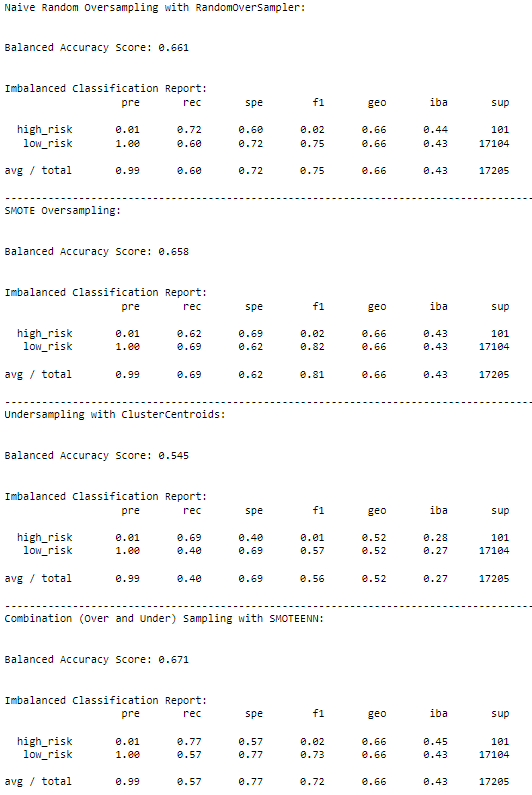
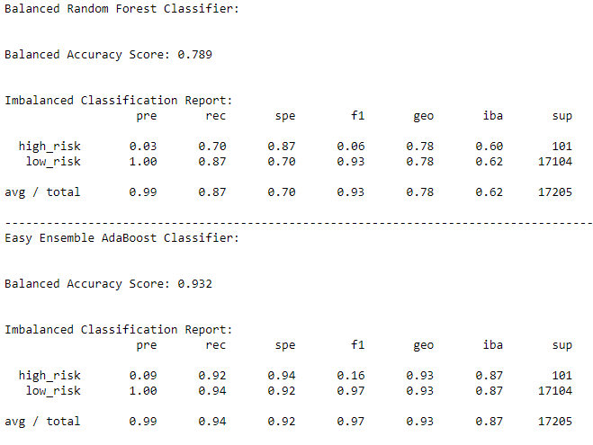

# Credit_Risk_Analysis

## Overview
Credit risk is an inherently unbalanced classification problem, as good loans easily outnumber risky loans. Different techniques were utilized to train and evaluate models with unbalanced classes. 

The following libraries were used to build and evaluate models using resampling: imbalanced-learn and scikit-learn. 

Using the credit card dataset, the data was oversampled using the RandomOverSampler and SMOTE algorithms, and undersampled using the ClusterCentroids algorithm. Then, a combinatorial approach of over- and undersampling was used with the SMOTEENN algorithm. 

Next, two machine learning models that reduce bias was used to predict credit risk: BalancedRandomForestClassifier and EasyEnsembleClassifier. 

## Results

### RandomOverSampler
- Balanced Accuracy Scores: 0.661
- high_risk Precision: 0.01
- low_risk Precision: 1.00
- high_risk Recall: 0.72
- low_risk Recall: 0.60

### SMOTE
- Balanced Accuracy Scores: 0.658
- high_risk Precision: 0.01
- low_risk Precision: 1.00
- high_risk Recall: 0.62
- low_risk Recall: 0.69

### ClusterCentroids
- Balanced Accuracy Scores: 0.545
- high_risk Precision: 0.01
- low_risk Precision: 1.00
- high_risk Recall: 0.69
- low_risk Recall: 0.40

### SMOTEENN
- Balanced Accuracy Scores: 0.671
- high_risk Precision: 0.01
- low_risk Precision: 1.00
- high_risk Recall: 0.77
- low_risk Recall: 0.57

### BalancedRandomForestClassifier
- Balanced Accuracy Scores: 0.789
- high_risk Precision: 0.03
- low_risk Precision: 1.00
- high_risk Recall: 0.70
- low_risk Recall: 0.87

### EasyEnsembleClassifier
- Balanced Accuracy Scores: 0.932
- high_risk Precision: 0.09
- low_risk Precision: 1.00
- high_risk Recall: 0.92
- low_risk Recall: 0.94

## Summary

The oversampling and undersampling algorithms were used on the original dataset to create resampled data, which was then used in a Logistic Regression model. 

The SMOTEENN algorithm had the highest balanced accuracy score of approximately 0.671. 

All four algorithms when fitted into a Logistic Regression model, produced the same high-risk and low-risk precision of 0.01 and 1.00, respectively. A low precision is indicative of a large number of false positives. 

SMOTEENN had the highest high-risk recall. SMOTE had the highest low-risk recall. A low recall is indicative of a large number of false negatives. 

The machine learning models of BalancedRandomForestClassifier and EasyEnsembleClassifier essentially outperformed the Logistic Regression model that used resampling algorithms. The EasyEnsembleClassifier had the highest overall balanced accuracy score, high-risk precision, high-risk recall, and low-risk recall. 

The overall goal is to determine high-risk vs low-risk loans. In this type of industry, it is important to not give out high-risk loans since there is a higher chance that the loan will not be paid off versus a low-risk loan. A machine learning model with a high, high-risk recall would be desired because a false negative is more important. If high-risk loans were predicted to be false, then the loan would probably be approved. In reality, they are actually true (or indeed a high-risk loan), which means there is a higher chance that the loan would not be paid off. Since the EasyEnsembleClassifier outperformed all other models and algorithms with the highest high-risk recall, it is the recommended model to use to determine credit risk and loan approval. 

